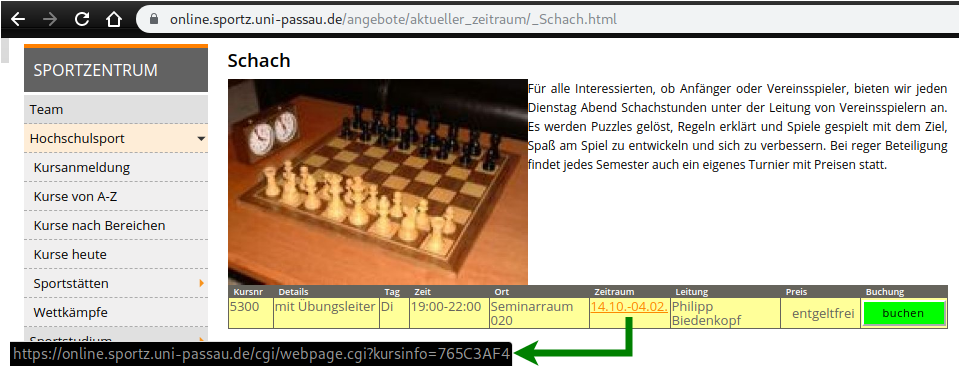

sportzcal — generate an iCalendar file from Sports Centre course dates
======================================================================

Usage
-----

1. Find the URL (web address) of the "course information" for the course set
   you're interested in (there may be multiple sets for a single course):
   

2. Run sportzcal with that URL; optionally specify an output file:

    ./sportzcal.py https://online.sportz.uni-passau.de/cgi/webpage.cgi?kursinfo=765C3AF4 -o schach.ics

3. Import the ics file into your calendar application or service.

Requirements
------------

- BeautifulSoup 4
- python-icalendar
- python-pytz (also required by python-icalendar)
- python-requests
- optionally: python-requests-cache

This script is developed on Python 3.7 — results with other Python versions may
vary.
